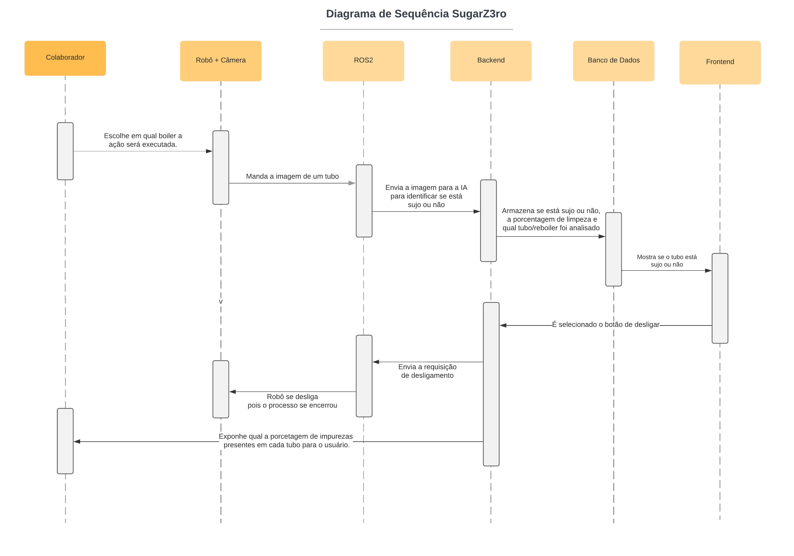

# Diagrama de Sequência

&emsp;&emsp;A criação de um diagrama de sequência é essencial na modelagem de sistemas e desenvolvimento de software, pois oferece uma representação clara das interações entre os componentes do sistema ao longo do tempo. No projeto SugarZ3ro para a Atvos, o diagrama de sequência é especialmente valioso pelos seguintes motivos:

## Visualização de Fluxos de Processos

&emsp;&emsp;Um diagrama de sequência fornece uma representação visual do fluxo de processos, permitindo aos engenheiros e desenvolvedores visualizarem a sequência de etapas envolvidas em um cenário particular. Isso é crucial para entender como as interações específicas ocorrem entre os objetos ao longo do tempo.

## Facilitação da Comunicação

&emsp;&emsp;Esses diagramas servem como uma linguagem comum entre os membros da equipe, incluindo desenvolvedores, designers e stakeholders. Eles ajudam a assegurar que todos tenham o mesmo entendimento do fluxo de operações, o que é essencial para a coordenação e colaboração eficaz.

## Identificação de Problemas e Otimização

&emsp;&emsp;Ao mapear as interações entre componentes, os diagramas de sequência podem ajudar a identificar ineficiências, redundâncias e potenciais pontos de falha no design do sistema. Isso permite otimizações antes da implementação, economizando tempo e recursos.

## Documentação e Planejamento

&emsp;&emsp;Um diagrama de sequência também atua como uma ferramenta de documentação que pode ser usada para o planejamento de projetos futuros ou manutenção do sistema atual. Ele serve como um guia para novos desenvolvedores e como um registro para referência futura.

## Teste e Verificação

&emsp;&emsp;O uso de diagramas de sequência auxilia na criação de casos de teste, permitindo que testadores verifiquem se o sistema está se comportando conforme o esperado em diferentes cenários de interação.

&emsp;&emsp;Dada a sua importância, o diagrama de sequência do projeto SugarZ3ro foi desenvolvido para garantir uma compreensão clara e precisa da sequência de eventos que ocorre quando um colaborador interage com o sistema. A seguir, o diagrama de sequência é apresentado com uma descrição detalhada das interações.

---

Figura 1 - Diagrama de sequência

Fonte: Elaborado pela equipe SugarZ3ro

## Descrição das Interações

1. **Início da Sequência:**
   - O **Colaborador** escolhe qual boiler será inspecionado.

2. **Robô + Câmera:**
   - Após a seleção do boiler, o **Robô** com a **Câmera** captura e envia a imagem do tubo para análise.

3. **ROS2:**
   - Recebe a imagem do tubo e encaminha para a Inteligência Artificial (IA) no **backend** para determinar se está sujo ou não.

4. **Backend:**
   - O **backend** processa a imagem com a IA para identificar a limpeza do tubo e envia os resultados para o banco de dados.
   - Realiza uma requisição de desligamento caso o **Frontend** determine que é necessário.

5. **Banco de Dados:**
   - Armazena o resultado da análise indicando se o tubo está sujo ou não, a porcentagem de limpeza e qual tubo/boiler foi analisado.

6. **Frontend:**
   - Mostra o resultado da análise do tubo ao colaborador e oferece a opção de desligar.

7. **Conclusão da Sequência:**
   - Se o botão de desligar é selecionado no **Frontend**, o **Robô** se desliga, pois o processo de inspeção terminou.
   - O robô também exibe ao **Colaborador** a porcentagem de impurezas presentes em cada tubo após o término do processo.

## Fluxo do Processo

&emsp;&emsp;O diagrama segue um fluxo linear de ações iniciadas pelo colaborador e termina com a entrega dos resultados da análise de limpeza. O processo depende da integração eficiente entre os componentes do sistema, usando ROS2 como middleware entre o dispositivo de hardware e o backend.

&emsp;&emsp;Este diagrama de sequência é crucial para entender o funcionamento do projeto e para assegurar que todos os componentes estão sincronizados para a execução das tarefas de inspeção e análise de limpeza de tubos.

---

&emsp;&emsp;Este documento foi desenvolvido em um periodo inicial e essa arquitetura pode sofrer alterações conforme o desenvolvimento do projeto.

