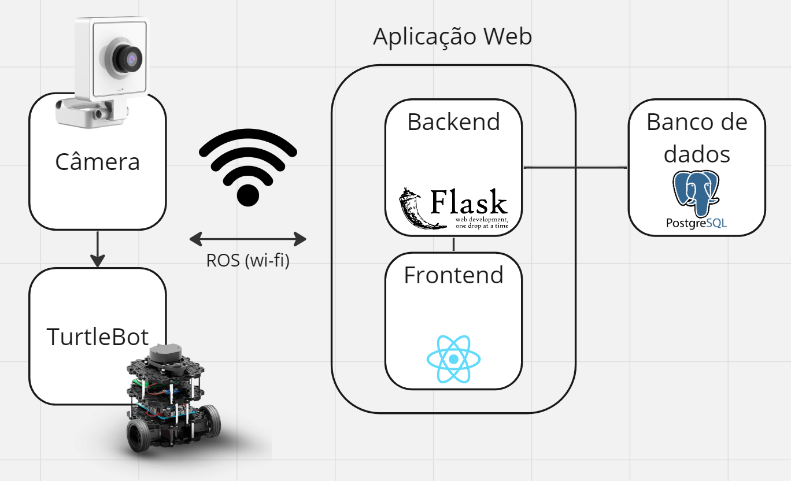

# Proposta de arquitetura

&emsp;&emsp;Para iniciar o desenvolvimento da solução de acordo com os requisitos funcionais e não-funcionais definidos previamente, a equipe SugarZ3ro fez uma proposta inicial de arquitetura do sistema envolvido na solução. Tal proposta é apresentada na figura 1 e já conta com as tecnologias que a equipe pretende utilizar no momento.

Figura 1 - Proposta inicial de arquitetura da solução

Fonte: Elaborado pela equipe SugarZ3ro

&emsp;&emsp;Como se observa na imagem, existem dois principais módulos na arquitetura. O primeiro refere-se ao hardware da solução e contempla tanto o robô TurtleBot quanto a câmera que é acoplada a este para uso de visão computacional. O segundo módulo, por sua vez, contempla o software envolvido na solução, o qual consiste em uma aplicação web com interface de frontend e backend integrados a um banco de dados. A comunicação entre esses dois módulos acontecerá por meio de wi-fi ou, mais precisamente, por meio de ROS, que é um conjunto de bibliotecas e ferramentas baseado em Linux para desenvolvimento de sistemas robóticos.

&emsp;&emsp;De maneira mais intimista, o primeiro módulo, por representar o robô TurtleBot, será o responsável por atender os requisitos funcionais de locomoção, identificação de canos entupidos e teleoperação. Isso será feito por meio do próprio robô, que já possui uma estrutura de locomoção (rodas), e de uma câmera conectada ao robô, cujas imagens capturadas serão enviadas via ROS para o outro módulo da arquitetura.

&emsp;&emsp;A aplicação web da solução, compreendida neste segundo módulo, pode ser subdividida em backend e frontend. O backend receberá os dados obtidos com as imagens capturadas pelas câmeras acopladas ao robô e irá armazená-las no banco de dados que serve ao sistema. Esses dados, em seguida, podem ser exibidos na interface frontend do projeto, mas esse não será o foco de desenvolvimento pela equipe, já que, de acordo com a empresa parceira, isso não agrega tanto valor à solução. Por outro lado, a utilidade da interface frontend se destaca com a necessidade de teleoperação do robô: é por meio da aplicação web que um usuário poderá controlar o robô de maneira remota.

&emsp;&emsp;À vista dessa estrutura básica, como percebe-se na figura 1, a equipe SugarZ3ro pré-definiu quais tecnologias serão utilizadas em cada parte da arquitetura. O nome de cada tecnologia, bem como em qual parte pretende-se implementá-la e o porquê da escolha de seu uso podem ser vistos na tabela 1, a seguir:

Tabela 1 - Proposta inicial de arquitetura da solução

| **Tecnologia**               | **Parte de implementação** | **Motivo da escolha**                                                 |
|------------------------------|----------------------------|-----------------------------------------------------------------------|
| Câmera (Dobot Magician Lite) | Câmera                     | Simplicidade de uso e fácil acesso                                    |
| TurtleBot                    | Robô                       | Potencial para prova de conceito e atendimento de objetivos didáticos |
| ROS                          | Comunicação entre módulos  | Estrutura desenvolvida com foco em sistema robóticos                  |
| Flask                        | Backend                    | Simplicidade de uso e fácil extensibilidade                           |
| Frontend                     | React                      | Simplicidade de uso e reusabilidade de componentes                    |
| PostgreSQL                   | Banco de dados             | Suporte para vários tipos de dados e alta extensibilidade             |

Fonte: Elaborado pela equipe SugarZ3ro
