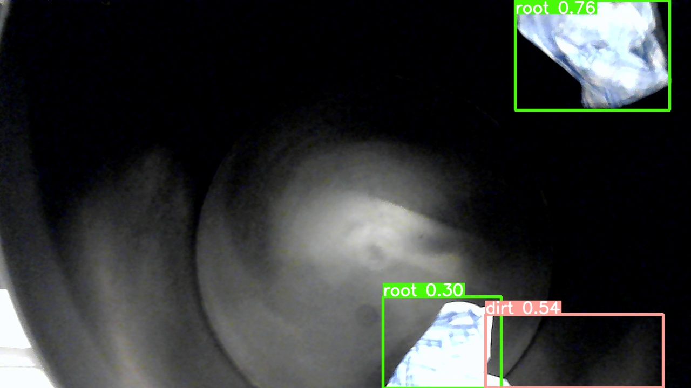

# Integração da Inteligência Artificial

&emsp;&emsp;Conforme descrito na proposta de solução, o sistema desenvolvido pela equipe SugarZ3ro conta com uma análise de imagens feita por IA (Inteligência Artificial). De maneira mais específica, o robô utilizado pela equipe recebeu uma câmera acoplada, a qual será responsável por captar imagens em tempo real dos canos dos reboilers contidos nas usinas da Atvos. A IA, como dito na [seção referente](./inteligencia_artificial.md), terá a função de analisar as imagens dos canos captadas e determinar, através de uma rede neural pré-treinada com YOLO, se o cano da imagem está sujo ou não.

&emsp;&emsp;Para que essa funcionalidade se adequasse à necessidade da empresa parceira e ao contexto dos usuários finais do protótipo, este modelo de IA desenvolvido na sprint 4 foi integrado à interface de usuário na sprint 5. Desse modo, o usuário pode ativar a detecção de impurezas a qualquer momento apertando o respectivo botão na tela de teloperação.

&emsp;&emsp;Para realizar a integração, foram desenvolvidos codigos nos seguintes arquivos: `app.py`, `camera.jsx`, `aiButton.jsx`. 

No arquivo `app.py`foi configurado o caminho para o banco de dados TinyDB e cria a tabela `pipes` para armazenar os dados recebidos.

```python
    db_path = os.path.join(os.path.dirname(__file__), '../data-base/pipes.json')
    db = TinyDB(db_path)
    pipes_table = db.table('pipes')
    Pipes = Query()
```

**Variáveis Globais**
```python
    imgStringBase64 = None
    model = YOLO('./best.pt')
```
- Define variáveis globais para armazenar a imagem recebida em base64 e o modelo de IA YOLO para processamento das imagens.

**Dados Atualizados**

```python
updated_data = {
    'id': 0,
    'status': None,
    'id-reboiler': None,
    'datetime': None
}
```
- Dicionário para armazenar os dados atualizados que serão salvos no banco de dados.

## Rotas

**Rota para Receber ID do Reboiler**

```python
@app.route('/post_reboiler_id', methods=['POST', 'GET'])
def post_reboiler_id():
    data = request.get_json()
    reboiler_id = data.get('reboilerID')
    updated_data['id-reboiler'] = reboiler_id
    print(f"Id recebido para o reboiler atual: {updated_data['id-reboiler']}")
    return jsonify({"reboilerID": reboiler_id}), 200
```
- Esta rota recebe o ID do reboiler inserido pelo usuário no frontend e o armazena na variável updated_data.

**Rota para Receber a Imagem do Frame**

```python
@app.route('/post_img_string', methods=['POST', 'GET'])
@cross_origin()  # Adiciona CORS para esta rota específica
def post_img_string():

    global imgStringBase64

    if request.method == 'POST':
        data = request.get_json()
        imgStringBase64 = data.get('currentFrame')
        print(f"imagem convertida")

        # converte a string da img em base64 p/ variável legível pro opencv
        decoded_data = base64.b64decode(imgStringBase64)
        np_data = np.fromstring(decoded_data, np.uint8)
        img = cv2.imdecode(np_data, cv2.IMREAD_COLOR)
        results = model(img)

        updated_data['id'] += 1
        updated_data['datetime'] = datetime.now().strftime('%Y-%m-%d %H:%M:%S')

        for result in results:
            
            updated_data['status'] = False

            # se mais de 0 sujeiras forem detectadas no frame
            if len(result.boxes.cls) > 0: 
                updated_data['status'] = True

        pipes_table.insert(updated_data)

        return jsonify({"message": "Imagem recebida com sucesso"}), 200

    return jsonify({"imgStringBase64": imgStringBase64}), 200

```
- Esta rota recebe uma imagem do frame atual capturado pelo usuário, convertida em uma string base64, e a processa usando o modelo YOLO. A imagem é decodificada e convertida para um formato legível pelo OpenCV. O modelo de IA processa a imagem e atualiza o status de acordo com a presença de sujeira detectada no frame. Os dados são então inseridos no banco de dados TinyDB.

&emsp;&emsp;Estas rotas são uteis para monitoramento em tempo real de reboilers, utilizando IA para detectar sujeiras em frames capturados, e armazenando todas as informações relevantes para análises futuras.

## Componente camera.jsx

&emsp;&emsp;O trecho do codigo a seguir em JavaScript é parte de um componente React que usa o hook `useEffect` para monitorar e enviar uma imagem capturada quando um botão de IA é pressionado. O código também gerencia o estado para evitar envios duplicados de imagens.

**Importação do Hook useEffect**

```javascript
useEffect(() => {
    if (aiButtonState && currentFrame && !hasSentImageString) {
        console.log('botao apertado'); // Log the currentFrame
```

&emsp;&emsp;O `useEffect` é utilizado para executar efeitos colaterais em componentes funcionais. Neste caso, ele monitora as mudanças no estado do botão de IA (`aiButtonState`), no frame atual (`currentFrame`), e na flag (`hasSentImageString`) que indica se a imagem já foi enviada. Se o botão de IA estiver pressionado, existir um frame atual, e a imagem ainda não tiver sido enviada, ele executa o bloco de código dentro do `if`.

**Envio da Imagem para o Backend**
```javascript
fetch('http://127.0.0.1:5000/post_img_string', {
    method: 'POST',
    headers: {
        'Content-Type': 'application/json',
    },
    body: JSON.stringify({ currentFrame: currentFrame }),
})
```
&emsp;&emsp;Aqui, o código faz uma requisição `POST` para o endpoint do backend (`http://127.0.0.1:5000/post_img_string`), enviando o frame atual convertido para uma string JSON no corpo da requisição. Os cabeçalhos especificam que o conteúdo é do tipo JSON.

**Atualização do Estado para Evitar Envios Duplicados**

```javascript
setHasSentImageString(true); // Mark that the frame has been logged
```
&emsp;&emsp;Após enviar a imagem, o código atualiza a flag `hasSentImageString` para true, evitando que a mesma imagem seja enviada novamente enquanto o botão de IA permanece pressionado.

&emsp;&emsp;De forma resumida, esse trecho de código tem as seguintes funções: 

    - Monitoramento do Estado: O `useEffect` monitora os estados do botão de IA, do frame atual, e da flag de envio.
    - Envio da Imagem: Quando o botão de IA é pressionado, existe um frame atual e a imagem ainda não foi enviada, a imagem é enviada para o backend.
    - Evitar Envios Duplicados: A flag hasSentImageString é atualizada para true após o envio da imagem, evitando envios duplicados.
    - Reset da Flag: Quando o botão de IA não está pressionado, a flag é redefinida para false, permitindo novos envios na próxima vez que o botão for pressionado.

&emsp;&emsp;Este código assegura que a imagem do frame atual seja enviada de forma eficiente e controlada ao backend sempre que o usuário interagir com o botão de IA.

## Componente aiButton.jsx

&emsp;&emsp;O trecho de código a seguir define um componente React chamado `aiButton`, que é um botão interativo utilizado para controlar o estado do envio de imagens processadas para o backend. Abaixo está uma explicação detalhada de como este componente se relaciona com os códigos anteriores do arquivo camera.jsx e do backend em Flask.

**Função de Manipulação de Clique**

```javascript
  const handleClick = () => {
    const newState = !buttonState;
    setButtonState(newState);
    if (typeof onButtonStateChange === 'function') {
      onButtonStateChange(newState);
    }
  }

```
&emsp;&emsp;A função handleClick alterna o estado do botão entre true e false sempre que o botão é clicado. Após atualizar o estado, verifica se a prop `onButtonStateChange` é uma função e, se for, chama essa função passando o novo estado do botão.

&emsp;&emsp;No arquivo `camera.jsx`, o `useEffect` monitora o estado do botão de IA (`aiButtonState`). O componente `aiButton` altera este estado através da prop `onButtonStateChange`. Quando o botão é clicado, `handleClick` muda o estado de buttonState e chama `onButtonStateChange`, passando o novo estado.

&emsp;&emsp;O backend em Flask possui a rota `/post_img_string` para receber a imagem do frame atual. Quando o botão AiButton é pressionado, o estado aiButtonState muda para true, desencadeando o envio da imagem pelo `useEffect` em `camera.jsx`.

&emsp;&emsp;A rota Flask `/post_img_string` recebe a imagem enviada pelo frontend e a processa utilizando o modelo YOLO. A interação entre o frontend (React) e o backend (Flask) é facilitada pelo componente `aiButton`, que controla quando as imagens são enviadas.


## Demonstração

&emsp;&emsp;A seguir, na figura 1, pode-se verificar uma imagem de exemplo capturada com a câmera acoplada ao robô e analisada a partir do modelo desenvolvido pela equipe.

<p style={{textAlign: 'center'}}>Figura 1 - Detecção de impurezas em simulação do cano</p>



<p style={{textAlign: 'center'}}>Fonte: Elaborado pela equipe SugarZ3ro</p>

&emsp;&emsp;Tal imagem refere-se à fotografia de uma lata de lixo preta com bolas papel coladas em seu interior, de forma a simular um cano de um reboiler. Na figura, é possível notar quadrados coloridos com palavras e números inscritos em seus cantos superiores direitos. Cada um desses nomes representa um elemento de sujeira diferente detectado, o que também se relaciona com o número registrado em cada quadrado, que representa a precisão de cada detecção destes elementos.

## Conclusão

&emsp;&emsp;Esta integração assegura que as imagens capturadas sejam enviadas de forma controlada e eficiente, acionando a lógica de backend para processamento de imagens apenas quando necessário.