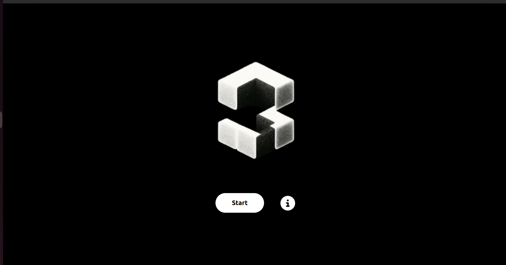

# Interface

## Introdução

&emsp;&emsp;Durante o projeto, a equipe SugarZ3ro concentrou seus esforços no desenvolvimento da interface gráfica. Conforme descrito na proposta inicial de arquitetura do projeto, a equipe utilizou React para construir a interface do usuário, permitindo uma interação intuitiva e eficiente com o sistema. A estilização foi realizada utilizando Tailwind CSS, que oferece uma abordagem utilitária para a aplicação de estilos, facilitando a manutenção e escalabilidade do projeto. Nota-se que toda a interface foi feita responsiva, pensando para uso de celulares, como iphone 14, Sansung Galaxy S23 e OnePlus 10 Pro, com tamanho de tela 1280x720 em modo paisagem.

## Tecnologias Utilizadas

### React
- React é uma biblioteca JavaScript para construir interfaces de usuário de forma declarativa. React facilita a criação de componentes interativos e reutilizáveis, permitindo desenvolver aplicações complexas de forma mais eficiente. É amplamente usada para desenvolver aplicações web e móveis.

### Tailwind CSS
- Tailwind CSS é um framework de CSS que utiliza uma abordagem utilitária para estilos. Ao invés de escrever CSS tradicional, os desenvolvedores podem aplicar classes utilitárias diretamente em elementos HTML, o que simplifica a manutenção de estilos e acelera o processo de desenvolvimento.

---

&emsp;&emsp;O frontend da aplicação web envolvida na solução possui 3 telas/páginas principais, cada uma com um endpoint específico. Estas telas são: tela de início, tela de informações e tela de teleoperação, as quais serão apresentadas e detalhadas a seguir.

## Tela de Início

&emsp;&emsp;A tela de início refere-se à primeira página que será visualizada pelo usuário ao utilizar a aplicação web. Nela, há a logo da equipe SugarZ3ro e dois botões sobre um fundo preto. Ao clicar no primeiro botão, no qual está inscrito `Start`, é aberto um pop-up (figura 2) que o usuário seleciona qual boiler está sendo operado. Ao clicar no outro botão, no qual está inscrito um símbolo de `i`, o usuário é redirecionado para a tela de informações.

Figura 1 - Tela de início

    

Fonte: Elaborado pela equipe SugarZ3ro

Figura 2 - Pop-up boiler

    

Fonte: Elaborado pela equipe SugarZ3ro

## Tela de Informações

&emsp;&emsp;A tela de informações descreve a função de cada um dos componentes existentes na tela de teleoperação. Cada um dos componentes em questão são exibidos em sequência vertical, havendo a possibilidade de navegação do usuário pela barra de rolagem existente na página — implementação pensada com base na escalabilidade para interfaces mobile. Por meio dessa tela, o usuário pode compreender como teleoperar o robô com a aplicação web.

Figura 3 - Tela de informações

    

Fonte: Elaborado pela equipe SugarZ3ro

  

## Tela de Teleoperação

&emsp;&emsp;A tela de teleoperação permite que o usuário controle a movimentação do robô remotamente. Nela, há a transmissão da imagem capturada pela câmera acoplada ao Turtlebot, o que permite uma melhor orientação de espaço ao usuário enquanto controla o movimento do robô pelos botões com setas indicativas de direção na parte inferior da tela. Vale citar que a movimentação por meio desses botões conta com **sistema de segurança**, cujo detalhamento pode ser visto na [respectiva seção da documentação](./movimentacao/seguranca.md).

Figura 4 - Tela de teleoperação

    

Fonte: Elaborado pela equipe SugarZ3ro

&emsp;&emsp;Além disso, há um botão de desligamento, um botão de emergência e um botão que ativa funcionalidades de IA. Como pode ser observado na figura 4, na qual estão marcados os botões. O botão de desligamento abre um pop-up demonstrado na figura 5 e, ao pressionar o botão de desligar, desfaz a conexão com o robô e volta a página inicial. O botão de emergência interrompe toda a comunicação atual com o robô e mostra um pop-up (como demonstrado na figura 6) informando ao usuário que a conexão foi interrompida.

Figura 5 - Botões da tela de teleoperação

    

Fonte: Elaborado pela equipe SugarZ3ro

Figura 6 - Pop-up de desligar

    

Fonte: Elaborado pela equipe SugarZ3ro

Figura 7 - Pop-up do botão de emergência

    

Fonte: Elaborado pela equipe SugarZ3ro

*Descrição dos Componentes:*
- AiButton:      Permite ao usuário ativar funcionalidades de inteligência artificial para análise da imagem capturada pelo câmera acoplada ao Turtlebot.
- VideoStream:   Transmite a imagem capturada pela câmera acoplada ao Turtlebot
- MoveForward:   Botão para movimentar o Turtlebot para frente
- MoveLeft:      Botão para movimentar o Turtlebot para esquerda
- MoveRight:     Botão para movimentar o Turtlebot para direita
- MoveBackward:  Botão para movimentar o Turtlebot para trás
- TurnOffButton: Responsável pela parada de emergência que encerra a movimentação do robô e desliga a comunicação com ele, encerrando as operações e retornando à tela inicial.

## Conclusão

&emsp;&emsp;O processo de transformação de wireframe para componentes interativos foi guiado pelo uso de React e Tailwind CSS, permitindo um desenvolvimento ágil e modular. Esta abordagem assegurou que cada componente pudesse ser desenvolvido, testado e estilizado em uma pagina de forma independente.