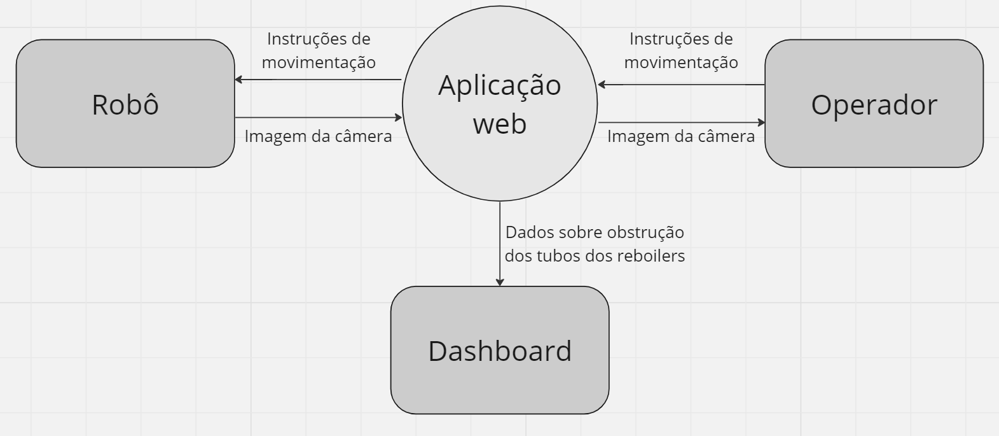

# Diagrama de contexto

&emsp;&emsp;Um diagrama de contexto se trata de uma ferramenta de UX design que torna visual o sistema e as relações de troca de informações que existem entre ele e entidades, que podem ser usuários ou outros sistemas, por exemplo. Sua principal utilidade reside no fato de tornar visível o fluxo de informação planejado para um determinado produto/sistema, de modo que os desenvolvedores possam estruturar uma arquitetura de informação adequada com os objetivos de seu projeto e favorável para os futuros usuários do produto.

&emsp;&emsp;À vista dos benefícios desse tipo de diagrama no processo de desenvolvimento, a equipe SugarZ3ro optou por elaborar um diagrama de contexto para pré-definir uma arquitetura inicial apropriada.

Figura 1 - Diagrama de contexto

Fonte: Elaborado pela equipe SugarZ3ro

&emsp;&emsp;Conforme descrito visualmente na figura 1, a aplicação web funciona como intermediária para todas as informações trocadas entre entidades na solução. Através dela, o usuário pode receber a imagem da câmera acoplada ao robô e, com base nessa imagem, enviar instruções de movimentação ao robô. Essas instruções chegam ao robô que, por sua vez, envia continuamente a imagem atualizada da câmera para a aplicação web.

&emsp;&emsp;A partir da imagem capturada pela câmera, a aplicação web é capaz de gerar dados sobre a obstrução dos tubos dos reboilers checados pelo robô. Esses dados, por sua vez, serão transferidos por meio de uma API para uma dashboard própria dos sistemas da Atvos, na qual os usuários terão acesso visual sobre quais tubos de quais reboilers estão obstruídos.

&emsp;&emsp;Em suma, percebe-se que, no momento inicial de desenvolvimento da solução, o fluxo de informação está estruturado de forma que a aplicação web recebe e envia todos os dados envolvidos no funcionamento de sistema. Desse modo, é coerente que ela atue como emissora dessas informações para os dashboards internos da Atvos.