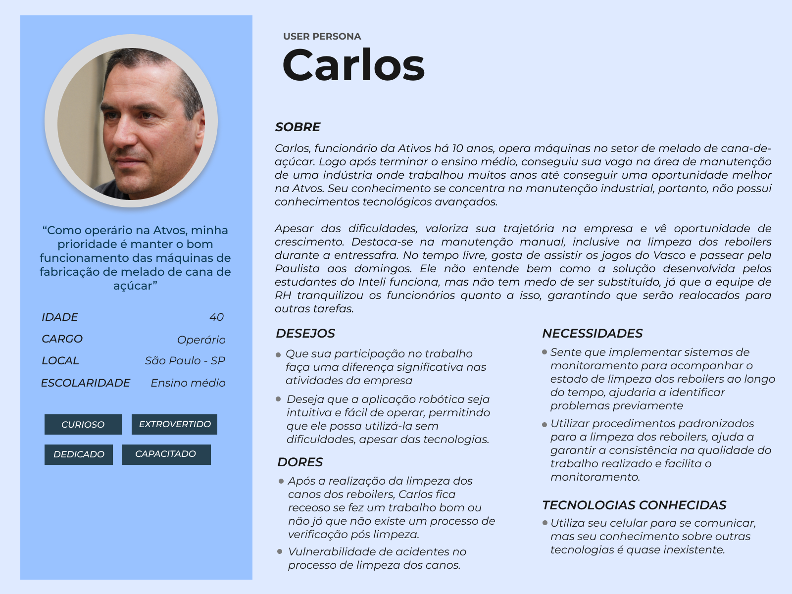
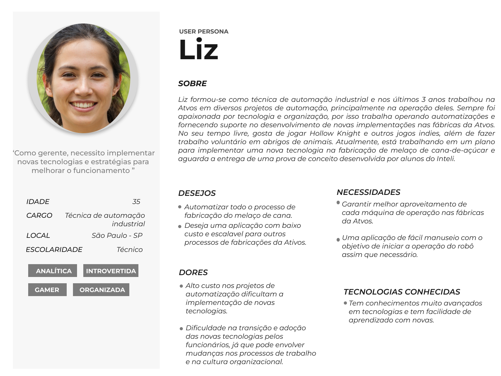

# Personas

No contexto do design centrado no usuário, as personas emergem como uma ferramenta crucial para compreender as complexidades do público-alvo e informar o processo de desenvolvimento de produtos e serviços. Visando a criação da persona ideal para o projeto proposto pela Atvos, a equipe analisou informações fornecidas pelo parceiro, juntamente com pesquisas realizadas em busca de dados reais que ajudassem a alcançar um melhor entendimento dos futuros usuários e das pessoas impactadas pela solução desenvolvida.

Como parte do projeto desenvolvido pelos alunos de Engenharia da Computação no Inteli, foram criadas duas personas principais que serão as mais impactadas pela solução. Foram analisadas as necessidades, dores, desejos e tecnologias conhecidas de cada uma dessas personas para uma melhor representação visual do público-alvo durante o desenvolvimento do projeto. Essas personas são Carlos e Liz, cujas representações visuais podem ser encontradas nas imagens a seguir:

Figura x - Persona - Carlos

Fonte:Elaborado pela equipe SugarZ3ro

Figura x - Persona - Liz

Fonte:Elaborado pela equipe SugarZ3ro

O desenvolvimento de personas não apenas possibilita a representação visual do público-alvo, mas também constrói uma compreensão mais profunda das necessidades e expectativas dos usuários finais. Este é um processo dinâmico que amplia o entendimento dos problemas apresentados, facilitando uma conexão mais profunda e empática com o público e, consequentemente, impactando na criação de uma solução que atenda às necessidades e expectativas do cliente de forma personalizada.

Destacamos que o público de principal utilização da solução são técnicos de automação que tenham conhecimentos básicos de controle de robôs em ambientes industriais. Este profissional será o principal responsável por coletar informações sobre a qualidade da limpeza e repassar o feedback do robô para os operários que realizam as limpezas dos canos de reboilers. Com conhecimento sobre as personas deste projeto, a equipe pode realizar o desenvolvimento da solução com objetivos mais concretos e claros para os membros e cliente.

