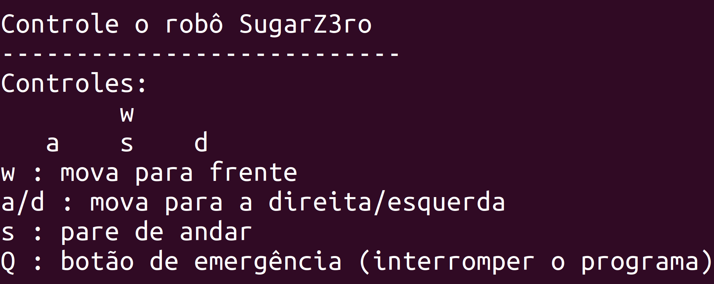

# Movimentação do robô

## Introdução

&emsp;&emsp;Durante a segunda sprint do projeto, a equipe SugarZ3ro focou no desenvolvimento de uma forma de movimentação do robô de maneira remota. Para isso, conforme descrito na [proposta inicial de arquitetura](../../sprint-1/arquitetura/arquitetura.md) do projeto, a equipe utilizou ROS 2 (Robot Operating System) através do sistema operacional Linux Ubuntu, que foi instalado tanto na Raspberry contida no Turtlebot quanto no computador utilizado para controlar a movimentação do robô.

## Estrutura de pastas/arquivos

&emsp;&emsp;Para tornar prático o desenvolvimento e a execução da movimentação remota do robô, a equipe optou por utilizar organização de diretórios padrão em projetos envolvendos ROS 2. Desse modo, a estrutura de pastas do projeto conta com um workspace em ```~/app/workspace```, diretório no qual há um pacote ROS ```SugarZ3ro_pkg``` criado pela equipe SugarZ3ro.

&emsp;&emsp;Tal pacote apresenta uma estrutura comum a pacotes ROS padrões, a qual é minuciosamente descrita na [documentação oficial do ROS](https://docs.ros.org/en/dashing/Tutorials/Creating-Your-First-ROS2-Package.html). Consequentemente, o script com o código para a movimentação remota do robô se encontra em ```./SugarZ3r0_pkg/movimentation.py``` e pode ser executada por meio de um comando pré-definido graças ao arquivo ```setup.py``` contido no diretório principal do pacote. 

## Execução

&emsp;&emsp;Para executar o controle da movimentação remota do robô, confira a [respectiva seção](../instalacao.md).

## CLI (Command Line Interface)

&emsp;&emsp;Após seguir o passo a passo de execução, o usuário terá acesso a uma CLI (Command Line Interface) que o permitirá movimentar o robô usando as teclas ```W```, ```A```, ```D```, ```S``` e ```Q```, como é apresentado na figura 1.

<p style={{textAlign: 'center'}}>Figura 1 - CLI para controle da movimentação do robô</p>



<p style={{textAlign: 'center'}}>Fonte: Elaborado pela equipe SugarZ3ro</p>

&emsp;&emsp;Cada uma das teclas mencionadas na captura de tela da figura 1 executa uma ação diferente ao ser pressionada, conforme a descrição na tabela 1, a seguir.

<p style={{textAlign: 'center'}}>Tabela 1 - Relação entre teclas e ações executadas</p>

| **Tecla** | **Ação**                                                   |
|-----------|------------------------------------------------------------|
| W         | Aumenta velocidade linear do robô                          |
| A         | Aumenta velocidade angular do robô em sentido anti-horário |
| D         | Aumenta velocidade angular do robô em sentido horário      |
| S         | Iguala a velocidade (linear e/ou angular) do robô a 0      |
| Q         | Interrompe a execução do código de movimentação do robô    |

<p style={{textAlign: 'center'}}>Fonte: Elaborado pela equipe SugarZ3ro</p>

&emsp;&emsp;Por aumento de velocidade linear, entende-se que o robô segue em linha reta. Já pelo aumento da velocidade angular em sentido anti-horário e sentido horário, entende-se que o robô vira, respectivamente, para a esquerda e para a direita em relação ao seu próprio eixo. Por fim, por igualar a velocidade do robô a 0, entende-se que o robô fica imóvel. 

## Sistema de segurança

&emsp;&emsp;O sistema de segurança é uma característica crítica em muitos sistemas robóticos, especialmente naqueles operados remotamente ou em ambientes que podem apresentar riscos para seres humanos ou para o próprio equipamento. Esta funcionalidade foi projetada para garantir maior segurança ao robô e ao usuário responsável pela operação do mesmo, proporcionando mais confiança ao realizar seu trabalho, uma vez que muitos dos possíveis erros de operação podem ser evitados através desse sistema.

&emsp;&emsp;A segurança deve ser de grande prioridade em sistemas robóticos interativos, trazendo varios beneficios como:

- Prevenção de danos: Protege o robô e o ambiente ao redor de danos em caso de mal funcionamento ou comportamento inesperado.

- Aumento da confiança do usuário: Permite que operadores humanos tenham controle final sobre ações robóticas, melhorando a confiança no uso de sistemas robóticos em ambientes complexos.

- Cumprimento requisitos regulatórios: Em muitos casos, a presença de um sistema de parada de emergência é um requisito legal para a operação de sistemas automatizados e robóticos.

&emsp;&emsp;Foram implementados dois sistemas de segurança com o objetivo de oferecer uma melhor usabilidade ao usuário, além de proporcionar mais segurança e confiança ao operar o robô. O primeiro está presente em todos os movimentos do robô, pois foi projetado para ser imediatamente parado quando as teclas de movimentação não estiverem ativadas, garantindo que, em caso de qualquer distração ou imprevisto durante a operação da solução, não ocorram acidentes e nenhum dano seja causado. O segundo sistema de segurança foi desenvolvido para que, em caso de qualquer condição anormal ou perigosa, o sistema de movimentação do robô possa ser encerrado imediatamente através da tecla```Q```.


