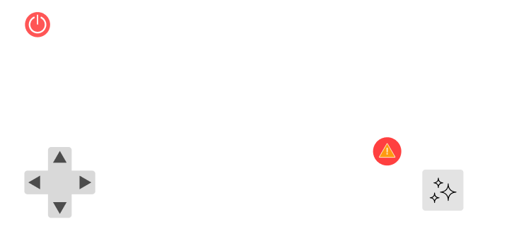

## Introdução
Wireframes são cruciais no desenvolvimento de interfaces de usuário, servindo como um esboço visual preliminar. Eles ajudam a planejar a disposição dos elementos interativos antes da implementação final, permitindo a identificação e correção de problemas de usabilidade de forma eficaz. Essa prática melhora a comunicação dentro das equipes de desenvolvimento e com os stakeholders.

## Wireframe Detalhado

### Tela 1: Página Inicial e Informações

- **Elementos**:
  - Ícone de informações ("i")
  - Botão "START"

- **Funcionalidades**:
  - Clicar em "START" direciona o usuário para a interface de controle do robô.
  - O ícone de informações leva ao detalhamento das funcionalidades dos botões.

### Tela 2: Desligamento do Robô

- **Descrição**:
  - Explicação do botão de desligamento do robô.
  - Botão "Voltar" para retornar à página inicial.

### Tela 3: Ativação da IA de Reconhecimento de Sujeira

- **Descrição**:
  - Detalhes sobre o botão que ativa a inteligência artificial para reconhecimento de sujeira.
  - Usuário pode ativar esta função para análise de imagem em tempo real.

### Tela 4: Movimentação do Robô

- **Descrição**:
  - Controles direcionais para mover o robô para a posição desejada.
  - Crucial para operações que exigem precisão de movimentação.

### Tela 5: Movimentação da Câmera

- **Descrição**:
  - Uso do joystick para ajustar o ângulo da câmera.
  - Permite capturar imagens específicas, útil em monitoramento ou inspeções detalhadas.

### Tela 6: Controle Principal do Robô

- **Descrição**:
  - Interface central que agrupa todos os controles do robô:
    - Desligamento
    - Movimentação
    - Controle da Câmera
    - Ativação da IA
    - Botão de Emergência

### Tela 7: Confirmação de Desligamento

- **Descrição**:
  - Mensagem de confirmação ao tentar desligar o robô.
  - Opções para "Cancelar" ou "Desligar" garantem uma operação segura.

## Conclusão
Este wireframe descreve detalhadamente cada interface do software de controle do robô, assegurando que o usuário tenha uma experiência intuitiva e eficaz, ao mesmo tempo que maximiza a funcionalidade e a usabilidade do sistema.
