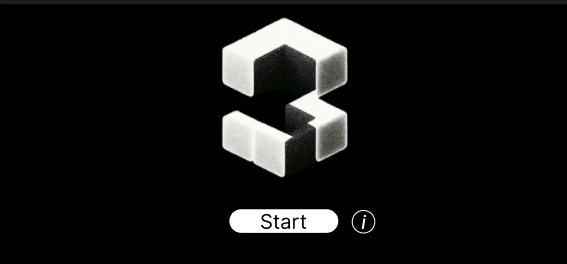
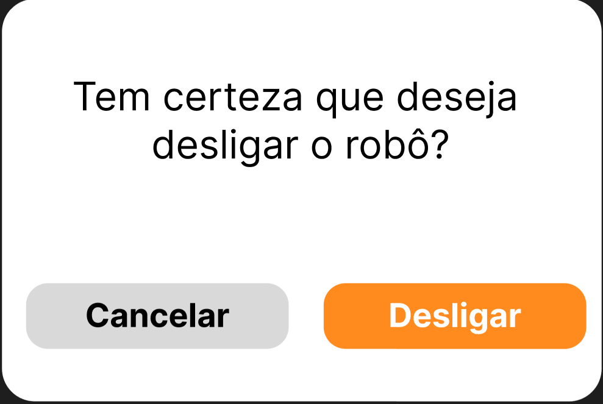

## Introdução
&emsp;&emsp;Wireframes são cruciais no desenvolvimento de interfaces de usuário, servindo como um esboço visual preliminar. Eles ajudam a planejar a disposição dos elementos interativos antes da implementação final, permitindo a identificação e correção de problemas de usabilidade de forma eficaz. Essa prática melhora a comunicação dentro das equipes de desenvolvimento e com os stakeholders.

## Wireframe Detalhado

### Tela 1: Página Inicial

- **Elementos**:
  - Ícone de informações ("i")
  - Botão "START"

- **Funcionalidades**:
  - Clicar em "Start" direciona o usuário para a interface de controle do robô.
  - O ícone de informações leva ao detalhamento das funcionalidades dos botões.

### Tela 2: Informações
- **Elementos**:
  - Botão de voltar
  - Caixa de instruções
- **Descrição**:
  - Autoexplicativo, o botão retorna à página inicial.
  - A caixa de instruções contém os botões exibidos na tela durante o controle do robô e tem o objetivo de esclarecer o devido funcionamento de cada botão.

### Tela 3: Tela de Controle

- **Descrição**:
  - Interface central que agrupa todos os controles do robô:
    - Desligamento
    - Movimentação
    - Ativação da IA
    - Botão de Emergência
- **Botões**:
  - Desligamento: Esse botão tem a função de desligar o robô e enviar o usuário de volta à tela inicial.
  - Movimentação: São utilizadas as setas para movimentar o robô.
  - Ativação da IA: Usuário pode ativar esta função para análise de imagem em tempo real.
  - Botão de Emergência: Esse botão faz com que o carrinho pare imediatamente.

### PopUp: Confirmação de Desligamento

- **Descrição**:
  - Mensagem de confirmação ao tentar desligar o robô.
  - Opções para "Cancelar" ou "Desligar" garantem uma operação segura.

## Conclusão
Este wireframe descreve detalhadamente cada interface do software de controle do robô, assegurando que o usuário tenha uma experiência intuitiva e eficaz, ao mesmo tempo que maximiza a funcionalidade e a usabilidade do sistema.
