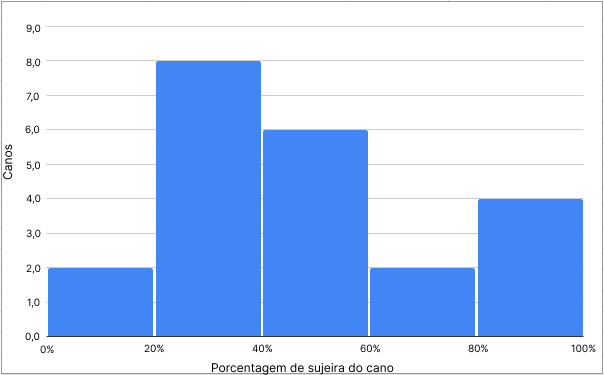
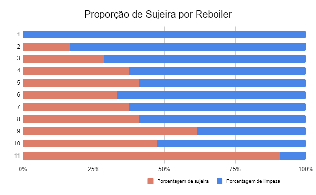

# Sugestão de Gráficos e Documentação da API
## Gráficos Sugeridos
### Histograma: Distribuição da Porcentagem de Sujeira (dirty-grade)
- Justificativa: Um histograma pode ser utilizado para mostrar a distribuição da porcentagem de sujeira nos canos. Isso pode revelar padrões, como a maioria dos canos tendo uma sujeira leve, moderada ou alta.
- Exemplo: Eixos x representando intervalos de porcentagem de sujeira e y representando a quantidade de canos dentro de cada intervalo.

### Gráfico de Barras Empilhadas: Status de Limpeza por Reboiler
- Justificativa: Esse gráfico mostra a quantidade de canos limpos e sujos por reboiler. Ele permite uma visualização clara de quais reboilers têm mais canos limpos ou sujos, ajudando a direcionar esforços de manutenção.
- Exemplo: Cada barra representando um reboiler (id-boiler) e sendo dividida em segmentos que representam canos limpos e sujos (status).

## Dados da API

### Informações Gerais
A API do projeto deve fornecer os dados relacionados a limpeza dos reboilers. Nesse sentido, o usuário poderá acessar dados como: identificador do cano; o status de limpeza boleano (True or False) do cano, basedo na análise de visão computacional; identificador do reboiler; porcentagem de sujeira do cano e, por fim a data e horário que as informações foram coletadas.