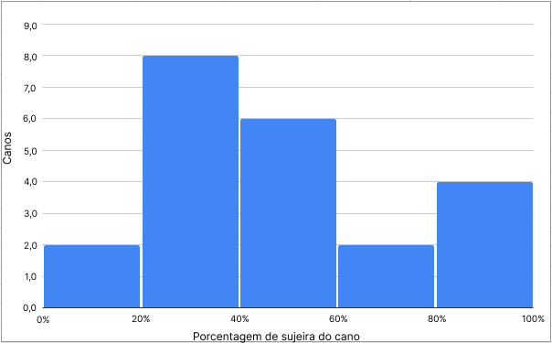
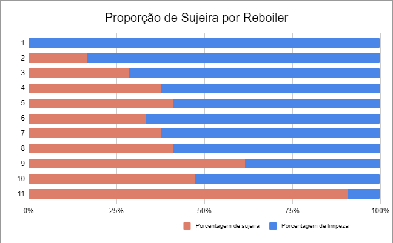

# Sugestão de Gráficos e Documentação da API

## Gráficos Sugeridos

&emsp;&emsp;Na sprint 3, a fim de visualizar como o uso da solução em forma de produto final se daria num cenário real, a equipe SugarZ3ro idealizou diferentes tipos de gráficos que poderiam ser exibidos aos usuários da solução. Tais gráficos poderiam ser construídos automaticamente (através de ferramentas como o Power BI próprio da empresa) com base nos dados extraídos durante a operação dos robôs nos reboilers, recebidos por meio de uma API existente na solução final.

### Histograma: Distribuição da Porcentagem de Sujeira (dirty-grade)

- Justificativa: Um histograma pode ser utilizado para mostrar a distribuição da porcentagem de sujeira nos canos. Isso pode revelar padrões, como a maioria dos canos tendo uma sujeira leve, moderada ou alta.
- Exemplo: Eixos x representando intervalos de porcentagem de sujeira e y representando a quantidade de canos dentro de cada intervalo.

Figura 1 - Exemplo de histograma

    

Fonte: Elaborado pela equipe SugarZ3ro

### Gráfico de Barras Empilhadas: Status de Limpeza por Reboiler

- Justificativa: Esse gráfico mostra a quantidade de canos limpos e sujos por reboiler. Ele permite uma visualização clara de quais reboilers têm mais canos limpos ou sujos, ajudando a direcionar esforços de manutenção.
- Exemplo: Cada barra representando um reboiler (id-boiler) e sendo dividida em segmentos que representam canos limpos e sujos (status).

Figura 2 - Exemplo de gráfico de barras empilhadas

    

Fonte: Elaborado pela equipe SugarZ3ro

## Dados da API

### Informações Gerais

&emsp;&emsp;A API do projeto deve fornecer os dados relacionados a limpeza dos reboilers. Nesse sentido, o usuário poderá acessar dados como: identificador do cano; o status de limpeza boleano (True or False) do cano, basedo na análise de visão computacional; identificador do reboiler; porcentagem de sujeira do cano e, por fim a data e horário que as informações foram coletadas.