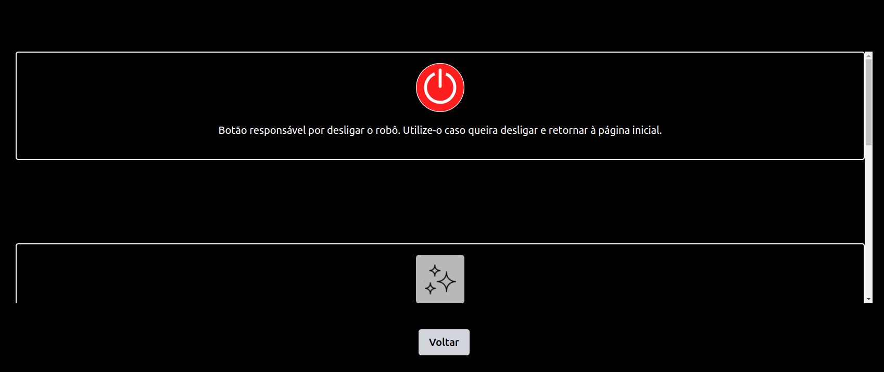

# Transformação do Wireframe em Interface

## Introdução

&emsp;&emsp;Durante a terceira sprint do projeto, a equipe SugarZ3ro concentrou seus esforços no desenvolvimento da interface gráfica. Conforme descrito na proposta inicial de arquitetura do projeto, a equipe utilizou React para construir a interface do usuário, permitindo uma interação intuitiva e eficiente com o sistema. A estilização foi realizada utilizando Tailwind CSS, que oferece uma abordagem utilitária para a aplicação de estilos, facilitando a manutenção e escalabilidade do projeto.

## Tecnologias Utilizadas

### React
- React é uma biblioteca JavaScript para construir interfaces de usuário de forma declarativa. React facilita a criação de componentes interativos e reutilizáveis, permitindo desenvolver aplicações complexas de forma mais eficiente. É amplamente usada para desenvolver aplicações web e móveis.

### Tailwind CSS
- Tailwind CSS é um framework de CSS que utiliza uma abordagem utilitária para estilos. Ao invés de escrever CSS tradicional, os desenvolvedores podem aplicar classes utilitárias diretamente em elementos HTML, o que simplifica a manutenção de estilos e acelera o processo de desenvolvimento.

---

&emsp;&emsp;No momento de desenvolvimento atual, o frontend da aplicação web envolvida na solução possui 3 telas/páginas principais, cada uma com um endpoint específico. Estas telas são: tela de início, tela de informações e tela de teleoperação, as quais serão apresentadas e detalhadas a seguir.

## Tela de Início

&emsp;&emsp;A tela de início refere-se à primeira página que será visualizada pelo usuário ao utilizar a aplicação web. Nela, há a logo da equipe SugarZ3ro e dois botões sobre um fundo preto. Ao clicar no primeiro botão, no qual está inscrito `Start`, o usuário é redirecionado para a tela de teleoperação. Ao clicar no outro botão, no qual está inscrito um símbolo de `i`, o usuário é redirecionado para a tela de informações.

<p style={{textAlign: 'center'}}>Figura 1 - Tela de início</p>

<div style={{textAlign: 'center'}}>
    
</div>

<p style={{textAlign: 'center'}}>Fonte: Elaborado pela equipe SugarZ3ro</p>

### Implementação em React

```jsx
const MainMenu = () => {
  return (
    <div className="bg-black h-screen flex flex-col items-center justify-center">
      <div className="mb-8">
        
      </div>
      <div className='flex flex-col items-center space-y-4 md:flex-row md:space-x-10 md:mt-28'>
        <button className="bg-white text-black py-3 px-10 rounded-full font-bold hover:bg-gray-400 mt-2 md:mt-0">Start</button>
        <button className="bg-transparent text-white border-none hover:text-slate-400 mt-4 md:mt-0" style={{ borderRadius: '100%', borderWidth: '2px'}}>
            <FontAwesomeIcon icon={faCircleInfo} style={{ fontSize: '2.5rem'}}/>
        </button>
      </div>
    </div>
  );
};

export default MainMenu;
```

## Tela de Informações

&emsp;&emsp;A tela de informações descreve a função de cada um dos componentes existentes na tela de teleoperação. Cada um dos componentes em questão são exibidos em sequência vertical, havendo a possibilidade de navegação do usuário pela barra de rolagem existente na página — implementação pensada com base na escalabilidade para interfaces mobile. Por meio dessa tela, o usuário pode compreender como teleoperar o robô com a aplicação web.

<p style={{textAlign: 'center'}}>Figura 2 - Tela de informações (topo)</p>

<div style={{textAlign: 'center'}}>
    
</div>

<p style={{textAlign: 'center'}}>Fonte: Elaborado pela equipe SugarZ3ro</p>

<br/><br/>

<p style={{textAlign: 'center'}}>Figura 3 - Tela de informações (baixo)</p>

<div style={{textAlign: 'center'}}>
    
</div>

<p style={{textAlign: 'center'}}>Fonte: Elaborado pela equipe SugarZ3ro</p>

### Implementação em React

```jsx
const HelpScreen = () => {
  return (
    <div className='flex items-center bg-black flex-col align-middle h-screen'>
      <div>
        <div className="bg-black text-white w-full flex flex-col items-center justify-center border-2 border-white rounded p-4 overflow-auto mt-32">
          
          <p className="text-center my-4">
            Botão responsável por desligar o robô. Utilize-o caso queira desligar e retornar à página inicial.
          </p>
        </div>
      </div>
      <div className='mt-10'>
        <BtVoltarCinza />
      </div>
    </div>
  );
};
```

## Tela de Teleoperação

&emsp;&emsp;A tela de teleoperação permite que o usuário controle a movimentação do robô remotamente. Nela, há a transmissão da imagem capturada pela câmera acoplada ao Turtlebot, o que permite uma melhor orientação de espaço ao usuário enquanto controla o movimento do robô pelos botões com setas indicativas de direção na parte inferior da tela. Vale citar que a movimentação por meio desses botões conta com **sistema de segurança**, cujo detalhamento pode ser visto na [respectiva seção da documentação](./sistema-de-seguranca.md).

&emsp;&emsp;Além disso, há um botão de desligamento de emergência ao lado dos botões de movimentação e um botão que ativa funcionalidades de IA na parte superior da tela. Esse último ainda não se apresenta funcional, uma vez que sua implementação completa se dará na sprint 4 de desenvolvimento.

<p style={{textAlign: 'center'}}>Figura 4 - Tela de teleoperação</p>

<div style={{textAlign: 'center'}}>
    
</div>

<p style={{textAlign: 'center'}}>Fonte: Elaborado pela equipe SugarZ3ro</p>

### Implementação em React

```jsx
function TeleopScreen() {
  return (
    <TurtleBotController>
      {({ movementhandlers, collision }) => (
        <>
          <h1>Teleoperação</h1>
          {collision && <div className="alert">OBSTÁCULO DETECTADO!</div>}
          <AiButton />
          <VideoStream />
          <MoveForward movementhandlers={movementhandlers} collision={collision} />
          <MoveLeft movementhandlers={movementhandlers} collision={collision} />
          <MoveBackward movementhandlers={movementhandlers} collision={collision} />
          <MoveRight movementhandlers={movementhandlers} collision={collision} />
          <TurnoffButton movementhandlers={movementhandlers} />
        </>
      )}
    </TurtleBotController>
  );
}
```

*Descrição dos Componentes:*
- AiButton:      Permite ao usuário ativar funcionalidades de inteligência artificial para análise da imagem capturada pelo câmera acoplada ao Turtlebot.
- VideoStream:   Transmite a imagem capturada pela câmera acoplada ao Turtlebot
- MoveForward:   Botão para movimentar o Turtlebot para frente
- MoveLeft:      Botão para movimentar o Turtlebot para esquerda
- MoveRight:     Botão para movimentar o Turtlebot para direita
- MoveBackward:  Botão para movimentar o Turtlebot para trás
- TurnOffButton: Responsável pela parada de emergência que encerra a movimentação do robô e desliga a comunicação com ele, encerrando as operações e retornando à tela inicial.


## Conclusão

&emsp;&emsp;O processo de transformação de wireframe para componentes interativos foi guiado pelo uso de React e Tailwind CSS, permitindo um desenvolvimento ágil e modular. Esta abordagem assegurou que cada componente pudesse ser desenvolvido, testado e estilizado em uma pagina de forma independente.