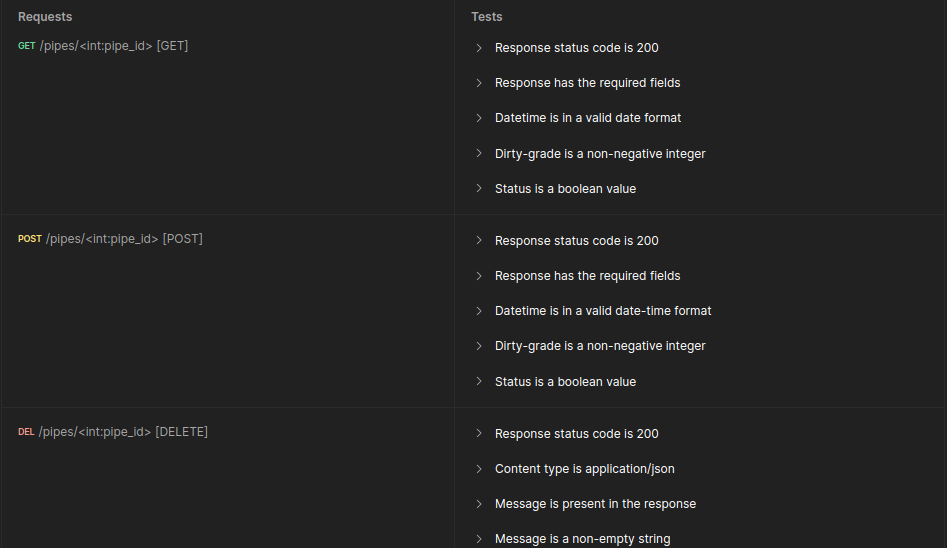

# Documentação da API do projeto

## Introdução

&emsp;&emsp;Como forma de atender aos interesses da Atvos, empresa parceira do projeto, a equipe SugarZ3ro desenvolveu uma API integrada à aplicação web existente na solução para que seja possível manipular com mais facilidade os dados referentes ao nível de sujeira dos canos de reboilers. Desse modo, a empresa poderá, de maneira prática, obter tais dados e exibí-los em forma de gráficos em sua plataforma interna própria para tal.

&emsp;&emsp;A API do projeto foi construída em Python com base no micro-framework Flask. Ela faz parte do backend da aplicação web do sistema e interage com o frontend desta, com o banco de dados e com a inteligência artificial utilizada para analisar os canos dos reboilers.

## Documentação dos itens importados

```
from flask import Flask, request, jsonify
from flask_cors import CORS, cross_origin
from tinydb import TinyDB, Query
import os
import random
from datetime import datetime
import cv2
import base64 
import numpy as np
from ultralytics import YOLO
```

### Flask
- **Flask**: Um microframework web para Python, utilizado para criar aplicações web de forma rápida e simples.
  - **Flask**: Classe principal do Flask usada para inicializar a aplicação.
  - **request**: Objeto que contém todos os dados da solicitação HTTP, permitindo acessar dados enviados pelo cliente.
  - **jsonify**: Função que converte um dicionário Python em uma resposta JSON adequada para uma aplicação web.

### Flask-CORS
- **Flask-CORS**: Extensão do Flask que permite a configuração de Cross-Origin Resource Sharing (CORS), essencial para permitir que recursos de uma página sejam requisitados de outro domínio.
  - **CORS**: Função que inicializa o CORS na aplicação Flask.
  - **cross_origin**: Decorador que permite configurar CORS em rotas específicas.

### TinyDB
- **TinyDB**: Um banco de dados NoSQL simples e leve, ideal para pequenos projetos e prototipagem.
  - **TinyDB**: Classe principal do TinyDB usada para inicializar e interagir com o banco de dados.
  - **Query**: Classe usada para criar consultas no TinyDB.

### os
- **os**: Módulo da biblioteca padrão do Python que fornece funções para interagir com o sistema operacional, como manipulação de arquivos e diretórios, variáveis de ambiente e execução de comandos do sistema.

### random
- **random**: Módulo da biblioteca padrão do Python que implementa geradores de números pseudo-aleatórios, usados para diversas operações que envolvem aleatoriedade.

### datetime
- **datetime**: Módulo da biblioteca padrão do Python que fornece classes para manipulação de datas e horas, permitindo operações como obtenção da data e hora atual, formatação e manipulação de datas.

### cv2
- **cv2**: Módulo da biblioteca OpenCV (Open Source Computer Vision Library) para Python, usado para processamento de imagens e visão computacional.

### base64
- **base64**: Módulo da biblioteca padrão do Python que fornece funções para codificação e decodificação de dados em base64, um esquema de codificação binária-to-text usado para representar dados binários em formato ASCII.

### numpy
- **numpy**: Biblioteca fundamental para computação numérica em Python, fornecendo suporte para arrays multidimensionais e diversas operações matemáticas eficientes.

### ultralytics
- **ultralytics**: Biblioteca que contém implementações de modelos de visão computacional, como o YOLO (You Only Look Once), usados para detecção de objetos em imagens.
  - **YOLO**: Classe usada para inicializar e utilizar modelos YOLO para tarefas de detecção de objetos.    

## Conexão com o Database
```python
db_path = os.path.join(os.path.dirname(__file__), '../data-base/pipes.json')
db = TinyDB(db_path)
pipes_table = db.table('pipes')
Pipes = Query()

updated_data = {
    'id': 0,
    'status': None,
    'id-reboiler': None,
    'datetime': None
}
```
### Inicialização do Banco de Dados
```python
db_path = os.path.join(os.path.dirname(__file__), '../data-base/pipes.json')
db = TinyDB(db_path)
pipes_table = db.table('pipes')
Pipes = Query()
```
- **db_path**: Define o caminho para o arquivo de banco de dados `pipes.json`.
- **db**: Inicializa o banco de dados TinyDB com o caminho especificado.
- **pipes_table**: Acessa a tabela `pipes` dentro do banco de dados.
- **Pipes**: Instância de `Query` para realizar consultas na tabela `pipes`.
- **updated_data**: Definição de uma variável global para receber os padrões do database.


## Documentação das rotas

&emsp;&emsp;Cada uma das rotas que compõem a API foi documentada com uso do Postman, software que facilita o processo de criação, testagem e documentação de APIs. A documentação da API pode ser acessada [clicando aqui](https://documenter.getpostman.com/view/27301833/2sA3XLEPvZ).

## Testagem das rotas

&emsp;&emsp;Cada uma das rotas que compõem a API também foi testada com uso do Postman. Foram realizados dois tipos de testes: manuais e automáticos.

### Testes manuais

&emsp;&emsp;Os testes manuais consistiram na criação manual de requisições para cada uma das rotas existentes na API. Cada uma das requisições foi criada e executada junto à execução local do servidor em Flask com uma taxa de 100% de sucesso (nenhuma das requisições falhou).

&emsp;&emsp;A seguir, há uma sequência de figuras com capturas de tela da testagem das rotas, mostrando qual rota foi testada, o corpo e parâmetros/argumentos passados para as requisições e o que foi retornado por elas, conforme descrito na documentação das rotas.

<p style={{textAlign: 'center'}}>Figura 1 - Teste de método [GET] bem sucedido na rota /post_reboiler_id</p>


<p style={{textAlign: 'center'}}>Fonte:Elaborado pela equipe SugarZ3ro</p>

<br/>

<p style={{textAlign: 'center'}}>Figura 2 - Teste de método [POST] bem sucedido na rota /post_reboiler_id</p>


<p style={{textAlign: 'center'}}>Fonte:Elaborado pela equipe SugarZ3ro</p>

<br/>

<p style={{textAlign: 'center'}}>Figura 3 - Teste de método [GET] bem sucedido na rota /pipes</p>


<p style={{textAlign: 'center'}}>Fonte:Elaborado pela equipe SugarZ3ro</p>

<br/>

<p style={{textAlign: 'center'}}>Figura 4 - Teste de método [POST] bem sucedido na rota /pipes</p>


<p style={{textAlign: 'center'}}>Fonte:Elaborado pela equipe SugarZ3ro</p>

<br/>

<p style={{textAlign: 'center'}}>Figura 5 - Teste de método [GET] bem sucedido na rota /pipes/[pipe_id]</p>

![Teste bem sucedido da rota /pipes/[pipe_id]](../../../../static/img/sprint-4/api/teste_rota_5.png)

<p style={{textAlign: 'center'}}>Fonte:Elaborado pela equipe SugarZ3ro</p>

<br/>

<p style={{textAlign: 'center'}}>Figura 6 - Teste de método [POST] bem sucedido na rota /pipes/[pipe_id]</p>

![Teste bem sucedido da rota /pipes/[pipe_id]](../../../../static/img/sprint-4/api/teste_rota_6.png)

<p style={{textAlign: 'center'}}>Fonte:Elaborado pela equipe SugarZ3ro</p>

<br/>

<p style={{textAlign: 'center'}}>Figura 7 - Teste de método [DELETE] bem sucedido na rota /pipes/[pipe_id]</p>

![Teste bem sucedido da rota /pipes/[pipe_id]](../../../../static/img/sprint-4/api/teste_rota_7.png)

<p style={{textAlign: 'center'}}>Fonte:Elaborado pela equipe SugarZ3ro</p>

<br/>

<p style={{textAlign: 'center'}}>Figura 8 - Teste de método [POST] bem sucedido na rota /pipes/simulate</p>


<p style={{textAlign: 'center'}}>Fonte:Elaborado pela equipe SugarZ3ro</p>

### Testes automáticos

&emsp;&emsp;Os testes automáticos são testes criados automaticamente por uma funcionalidade de IA existente no Postman. Esses testes são criados com base na funcionalidade esperada de cada rota e levam em conta a testagem de aspectos mais específicos das requisições que são feitas para cada uma delas.

&emsp;&emsp;A seguir, há uma sequência de figuras que apresenta diferentes tipos de testes automáticos realizados com o Postman para cada uma das rotas existentes na API do projeto.

<p style={{textAlign: 'center'}}>Figura 9 - Testes automáticos da rota /post_reboiler_id</p>


<p style={{textAlign: 'center'}}>Fonte:Elaborado pela equipe SugarZ3ro</p>

<br/>

<p style={{textAlign: 'center'}}>Figura 10 - Testes automáticos da rota /pipes</p>


<p style={{textAlign: 'center'}}>Fonte:Elaborado pela equipe SugarZ3ro</p>

<br/>

<p style={{textAlign: 'center'}}>Figura 11 - Testes automáticos da rota /pipes/[pipe_id]</p>

![Testes automáticos da rota /pipes/[pipe_id]](../../../../static/img/sprint-4/api/teste_rota_a3.png)

<p style={{textAlign: 'center'}}>Fonte:Elaborado pela equipe SugarZ3ro</p>

<br/>

<p style={{textAlign: 'center'}}>Figura 12 - Testes automáticos da rota /pipes/simulate</p>



<p style={{textAlign: 'center'}}>Fonte:Elaborado pela equipe SugarZ3ro</p>

&emsp;&emsp;Todos os testes automáticos foram bem sucedidos, com exceção dos que consistiram em verificar se as respostas de determinadas requisições iriam retornar o valor da chave `datetime` como um objeto datetime, o que não ocorre na prática. A API foi construída de modo a retornar os dados requisitados por meio do formato `json`, o que faz com que as datas (incluindo ano, mês, dia, hora, minutos e segundos) de registros de canos sejam salvas como `string` e não como um objeto específico do tipo `datetime`. Contudo, isso não afeta a funcionalidade da API ou o uso dela para futura criação de gráficos através de uma plataforma interna da empresa parceira.