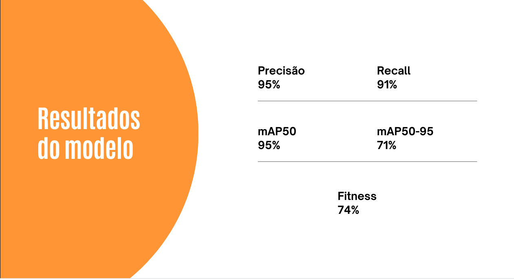

## Introdução
Nesta seção, vamos explorar o desempenho do modelo preditivo que foi desenvolvido utilizando a YOLO V8, uma das mais avançadas arquiteturas para detecção de objetos em imagens. Além disso, vamos descrever como as métricas foram utilizadas para a construção e avaliação da Inteligência Artificial. Nosso objetivo é explicar de forma clara e simples essas métricas, para que qualquer pessoa, mesmo sem background técnico, consiga entender os resultados e sua importância no desenvolvimento do modelo.

## O que é YOLO V8?
YOLO (You Only Look Once) é uma série de modelos de rede neural projetados para a detecção de objetos. O que torna o YOLO especial é sua capacidade de identificar e localizar múltiplos objetos em uma única imagem de maneira extremamente rápida e precisa. A versão V8 do YOLO é a mais recente, oferecendo melhorias significativas em termos de precisão e velocidade em relação às versões anteriores.

## Métricas do Modelo
As métricas são indicadores utilizados para avaliar a performance do modelo preditivo. Na imagem acima, apresentamos as seguintes métricas:
Precisão, Recall, mAP50, mAP50-95, e Fitness.

    

### Precisão (95%)
A precisão indica a porcentagem de verdadeiros positivos (detecções corretas) em relação ao total de detecções feitas pelo modelo. Uma precisão de 95% significa que, de todas as detecções feitas pelo modelo, 95% eram corretas. Isso é importante porque demonstra a confiabilidade do modelo em identificar objetos sem muitos falsos alarmes.

### Recall (91%)
O recall mede a capacidade do modelo de identificar todos os objetos relevantes em uma imagem. Um recall de 91% significa que o modelo conseguiu detectar 91% dos objetos presentes nas imagens. Isso é crucial para garantir que o modelo não perca objetos importantes.

### mAP50 (95%)
O mAP50 (mean Average Precision at 50% IoU) é a média das precisões para diferentes classes de objetos, considerando uma sobreposição mínima de 50% entre a detecção e o objeto real. Um valor de mAP50 de 95% indica que, em média, o modelo tem um alto desempenho na detecção de várias classes de objetos, com uma boa precisão em termos de localização.

### mAP50-95 (71%)
O mAP50-95 é uma métrica mais rigorosa que calcula a média das precisões considerando sobreposições de 50% até 95%. Um valor de 71% mostra que, embora o modelo seja altamente preciso em uma sobreposição de 50%, a precisão diminui em sobreposições mais altas, o que é normal, pois a tarefa se torna mais difícil.

### Diferença entre mAP50 e mAP50-95

As métricas mAP50 e mAP50-95 são ambas utilizadas para avaliar a precisão de um modelo de detecção de objetos, mas elas diferem na forma como a precisão é calculada em relação à sobreposição entre as detecções do modelo e os objetos reais nas imagens.

- **mAP50**: Foca em uma única sobreposição de 50%, oferecendo uma visão de como o modelo se comporta com uma exigência de sobreposição moderada.
- **mAP50-95**: Foca em uma faixa de sobreposições, oferecendo uma avaliação mais rigorosa e abrangente do desempenho do modelo em diferentes níveis de precisão.

Ambas as métricas são importantes, mas juntas elas fornecem uma visão mais completa da capacidade do modelo de detectar e localizar objetos em diferentes cenários.

### Fitness (74%)
A métrica de Fitness combina várias métricas para dar uma visão geral do desempenho do modelo. Um valor de 74% indica que, de forma geral, o modelo tem um bom desempenho, equilibrando precisão e recall de maneira eficiente.

## Conclusão
As métricas descritas foram fundamentais para a construção e avaliação do modelo de Inteligência Artificial desenvolvido com a YOLO V8. Elas permitiram medir e garantir a eficácia do modelo em identificar e localizar objetos com alta precisão e recall. Através do uso das métricas mAP50, mAP50-95, e fitness, pudemos comparar diferentes modelos e escolher a melhor solução para o projeto. Este processo garantiu que a solução final fosse robusta e eficiente, atendendo às necessidades e expectativas de forma clara e compreensível para todos os envolvidos.