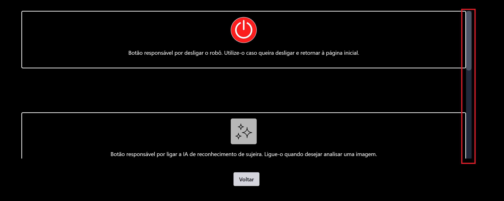

# Introdução

&emsp;&emsp;Na Sprint 4 foram realizados testes para verificar a usabilidade do sistema. Nesses testes foram relatados alguns problemas de experiência de usuário (UX) na plataforma, como botões sem funcionalidades, falta de feedback e uma interface não intuitiva. Assim, essa seção descreverá sobre as mudanças na interface feitas na Sprint 5, bem como a adição de novas funcionalidades para comportar a integração da inteligência artificial no sistema.

# Mudanças no frontend

## Barra de rolagem

&emsp;&emsp;Foi relatado nos testes que não era intuitivo algumas páginas do sistema conterem rolagem vertical, então com isso em mente foi desenvolvido outra barra de rolagem a fim de deixar mais intuitiva a navegabilidade no site. As figuras abaixo demonstram a barra de rolagem antes e depois da mudança (destacadas por um quadrado vermelho).

Figura 1 - Barra de rolagem depois da mudança

Fonte:Elaborado pela equipe SugarZ3ro

## Aplicação em versão mobile para a tela TeleopScreen

&emsp;&emsp;A tela de teleoperação, ao contrário do resto do site, não estava responsiva. Como nossa aplicação é pensada para o usuário operar no celular, foi feito mudanças para a tela de teleoperação conseguir ser usada no celular sem problemas. As figuras abaixo demonstram todas as funcionalidades da tela de teleoperação no celular. Note que nossa aplicação foi feita para dispositivos mobile como X Y Z com dimensões aproximadas de MARIOLEMBRADETROCARxSeVerIssoNoPrMeDaUmToque.

## Mehora no feedback

&emsp;&emsp;Nos testes realizados foram relatados problemas de falta de feedback em algumas features presentes, como nos botões de desligar e de parada de emergência. Com base em conceitos de UX que visam melhorar a usabilidade, foram adicionados pop-ups nos dois botões anteriormente mencionados. As figuras abaixo demonstram os pop-ups criados.

## Resposta da IA

&emsp;&emsp;Visando integrar a ativação e a resposta da inteligência artificial ao projeto, foi criado um pop-up que recebe o resultado da IA e mostra-o na tela. A figura abaixo demonstra o pop-up criado.